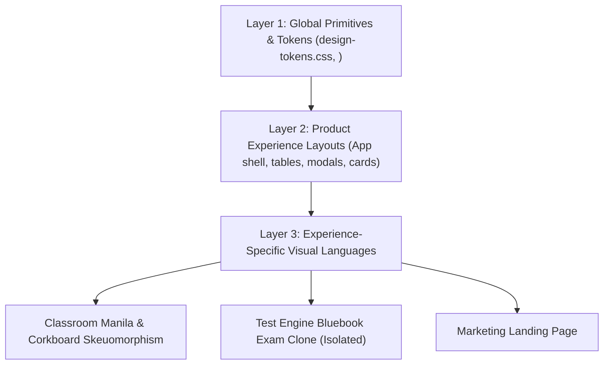

# Digital SAT Platform — UX-Centered Design System Specification

Tài liệu kỹ thuật và quy chuẩn trải nghiệm người dùng (UX Design System) cho hệ thống **Digital SAT Platform**.

---

## 1. Kiến trúc Boundary 3 Tầng (3-Layer Boundary Architecture)

Hệ thống phân tách tuyệt đối giữa **Global UI Primitives**, **Product Experience Layouts** và các **Experience-Specific Visual Languages**:



1. **Layer 1 — Global Primitives & Design Tokens (`design-tokens.css`)**:
   - Chứa 18 OKLCH semantic UX color roles, typography scale, motion durations, density variables và các UI primitives (`<x-ui.button>`, `<x-ui.card>`, `<x-ui.status-badge>`).
2. **Layer 2 — Product Experience Layouts**:
   - Khung ứng dụng chung (App shell, navigation bar, data tables, modals, settings forms).
3. **Layer 3 — Experience-Specific Visual Languages**:
   - **Classroom Workspace**: Bìa sổ Manila, đinh ghim corkboard, tem thư, handwriting accents. (Không được xuất ngược các phần tử trang trí này sang Admin hay Student Dashboard thông thường).
   - **Test Engine**: **Đóng băng tuyệt đối** theo chuẩn thi thật Bluebook (Inter + Noto Serif).
   - **Marketing Landing**: Typography Geist nhã nhặn.

---

## 2. Hệ thống Color Tokens Semantic (18 OKLCH Roles)

Màu sắc mô tả **vai trò UX** thay vì tên màu nguyên bản:

| Category | Token Name | OKLCH Value / Role |
|---|---|---|
| **Canvas** | `--ds-bg` | `oklch(98.5% 0.005 255)` — Nền ứng dụng chính |
| **Surfaces** | `--ds-surface` | `oklch(100% 0 0)` — Nền Card / Panel |
| | `--ds-surface-elevated` | `oklch(99.2% 0.005 255)` — Card nổi / Dropdown |
| | `--ds-surface-muted` | `oklch(96.5% 0.01 255)` — Nền phụ / Table header |
| **Typography** | `--ds-text-primary` | `oklch(20% 0.045 255)` — Văn bản chính (WCAG AAA) |
| | `--ds-text-secondary` | `oklch(40% 0.035 255)` — Văn bản phụ / Subtitle |
| | `--ds-text-tertiary` | `oklch(55% 0.03 255)` — Caption / Helper text |
| | `--ds-text-disabled` | `oklch(72% 0.02 255)` — Trạng thái vô hiệu hóa |
| | `--ds-text-inverse` | `oklch(99% 0 0)` — Chữ trên nền tối/brand |
| **Borders** | `--ds-border-subtle` | `oklch(93% 0.015 255)` — Viền phân cách nhẹ |
| | `--ds-border-default` | `oklch(88% 0.025 255)` — Viền Card tiêu chuẩn |
| | `--ds-border-strong` | `oklch(76% 0.045 255)` — Viền Input active / Hover |
| **Brand Scale** | `--ds-brand` | `oklch(38% 0.13 258)` — Nút bấm chính / Link |
| | `--ds-brand-hover` | `oklch(32% 0.13 258)` — State Hover |
| | `--ds-brand-soft` | `oklch(94.5% 0.035 258)` — Soft Badge background |
| **Interaction** | `--ds-focus` | `oklch(42% 0.15 258)` — High-contrast Focus Ring |
| | `--ds-overlay` | `oklch(15% 0.05 255 / 0.65)` — Modal backdrop |

---

## 3. Focus System & Accessible Navigation (WCAG 2.1 AA)

- **Focus Ring Rule**: Focus state là **navigation affordance** tối quan trọng cho người dùng bàn phím.
- **Công thức Focus Ring chuẩn**:
  ```css
  button:focus-visible, a:focus-visible, input:focus-visible {
      outline: none !important;
      box-shadow: 0 0 0 2px #ffffff, 0 0 0 4px var(--ds-focus) !important;
  }
  ```
  -> Đảm bảo tương phản rõ ràng 100% opacity trên nền sáng, nền tối lẫn nền giấy Manila.

---

## 4. Density Modes & Mobile Spatial Budget

- **Density Modes**:
  - **Compact** (`--density-compact-padding: 0.5rem`): Áp dụng cho Admin Dashboard, Test Builder, Data Tables.
  - **Comfortable** (`--density-comfortable-padding: 1rem`): Áp dụng cho Student Portal, Classroom workspace.
  - **Spacious** (`--density-spacious-padding: 2rem`): Áp dụng cho Landing Page.
- **Mobile Spatial Budget (<640px)**:
  - Ẩn hoàn toàn các lớp trang trí không phục vụ chức năng (`.cork-note__pin`, `.ds-tape-strip`, `.ds-decorative-stamp`) trên thiết bị di động để dành tối đa diện tích hiển thị nội dung chính.

---

## 5. Motion System & Reduced Motion

- **Scale Thời Gian Transition**:
  - `motion-fast`: `150ms cubic-bezier(0, 0, 0.2, 1)` (Button press, tooltip).
  - `motion-normal`: `200ms cubic-bezier(0, 0, 0.2, 1)` (Card hover, dropdown open).
  - `motion-slow`: `300ms cubic-bezier(0, 0, 0.2, 1)` (Modal backdrop, drawer slide).
- **Reduced Motion Overrides**:
  - Tự động tắt toàn bộ hiệu ứng chuyển động khi người dùng bật `prefers-reduced-motion: reduce`.

---

## 6. Hiến pháp UX (UX Constitution & Invariants)

1. **Single Primary Action Rule**: Mỗi view hoặc card chỉ được có **tối đa một nút Primary Action** (`variant="primary"`). Các hành động phụ dùng `secondary` hoặc `ghost`.
2. **Multi-Modal Status Signals (WCAG 1.4.1)**: Không dùng màu sắc làm tín hiệu duy nhất. Badge trạng thái bắt buộc chứa **Icon + Text + Color**.
3. **Playfair Display Restrictions**: Font `Playfair Display` italic chỉ dùng cho lớp cảm xúc/contextual (nhãn viết tay, quote, con dấu). **Cấm dùng Playfair cho nút bấm, số liệu hay dữ liệu quan trọng**.
4. **Cấm Side-Stripe Decorative Accent**: Không dùng `border-left: 4px/5px solid` làm trang trí ngẫu nhiên cho card. Dùng viền mỏng toàn phần (`border border-slate-200`) + background tint.
5. **Cấm Z-Index Tùy tiện**: Luôn tuân thủ thang z-index chuẩn: `dropdown: 30` → `sticky: 35` → `backdrop: 40` → `modal: 50` → `toast: 60` → `tooltip: 10000`.

