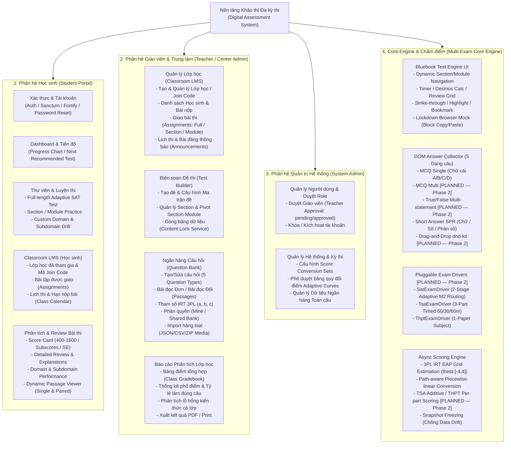
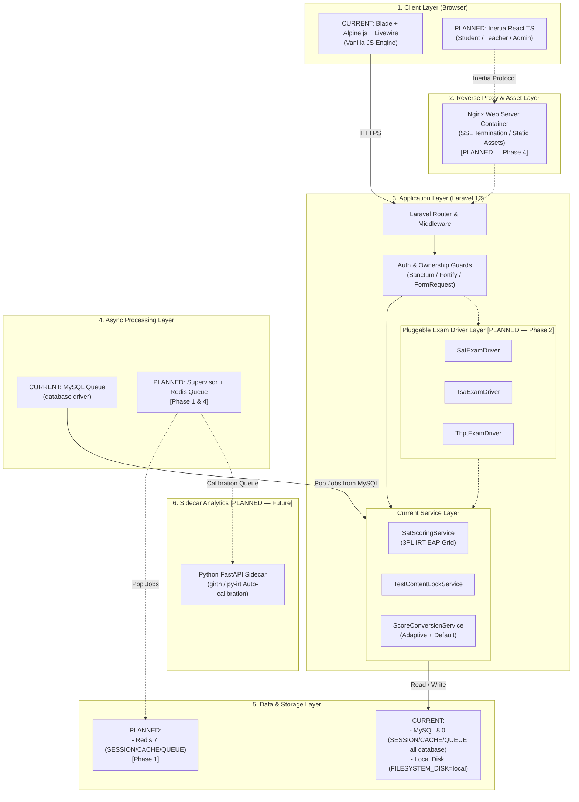
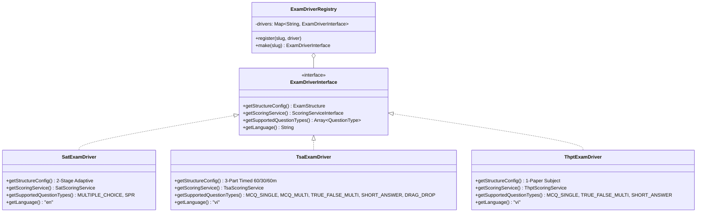
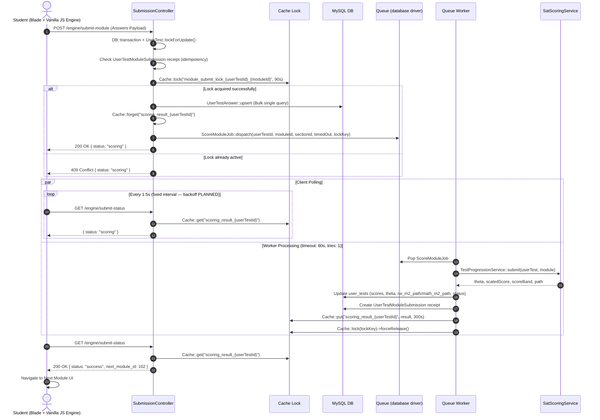
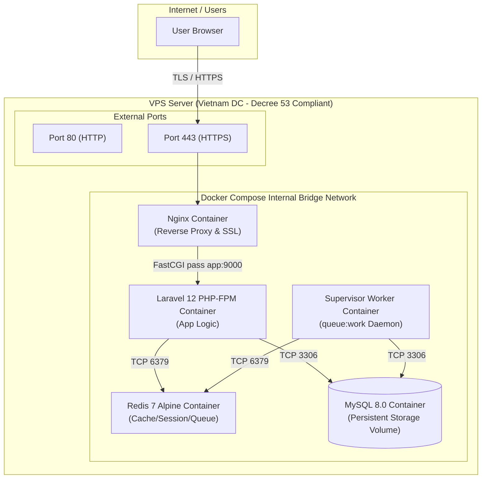
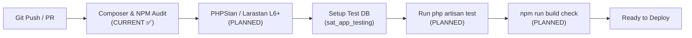
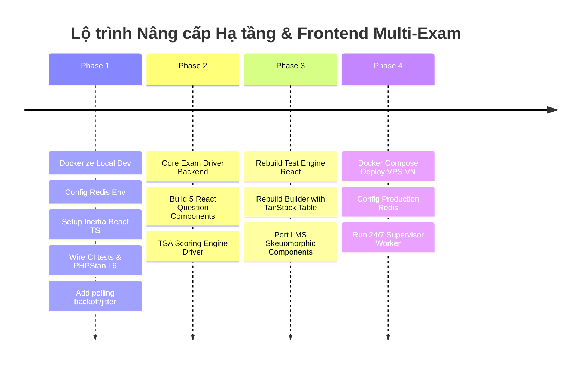

# Tài liệu Thiết kế Kiến trúc Hệ thống & Lộ trình Nâng cấp

## System Architecture & Technical Roadmap Specification

> **Trạng thái:** Chốt chính thức (Locked 2026-08-02)  
> **Phiên bản:** 3.0 (Reviewed & corrected against codebase)  

> [!NOTE]
> **Quy ước đánh dấu trong tài liệu:**
>
> - Không có tag = **đang tồn tại trong codebase hiện tại** (verified against migrations, services, config).
> - `[PLANNED — Phase N]` = **kiến trúc quy hoạch**, chưa có code. Sẽ được xây dựng trong Phase tương ứng.
> - Trong sơ đồ Mermaid: đường nét đứt `-.->` = thành phần quy hoạch.

---

## Mục lục (Table of Contents)

- [Tài liệu Thiết kế Kiến trúc Hệ thống \& Lộ trình Nâng cấp](#tài-liệu-thiết-kế-kiến-trúc-hệ-thống--lộ-trình-nâng-cấp)
  - [System Architecture \& Technical Roadmap Specification](#system-architecture--technical-roadmap-specification)
  - [Mục lục (Table of Contents)](#mục-lục-table-of-contents)
  - [1. Tổng quan \& Mục tiêu (Overview \& Objectives)](#1-tổng-quan--mục-tiêu-overview--objectives)
    - [1.1 Bối cảnh \& Mục đích (Context \& Purpose)](#11-bối-cảnh--mục-đích-context--purpose)
    - [1.2 Phạm vi (Scope: In-scope \& Out-of-scope)](#12-phạm-vi-scope-in-scope--out-of-scope)
      - [**In-scope (Nằm trong phạm vi):**](#in-scope-nằm-trong-phạm-vi)
      - [**Out-of-scope (Không nằm trong phạm vi):**](#out-of-scope-không-nằm-trong-phạm-vi)
    - [1.3 Thuật ngữ \& Từ viết tắt (Glossary)](#13-thuật-ngữ--từ-viết-tắt-glossary)
    - [1.4 Sơ đồ Phân rã Chức năng (Functional Decomposition Map)](#14-sơ-đồ-phân-rã-chức-năng-functional-decomposition-map)
      - [**A. Phân hệ Học sinh (Student Portal)**](#a-phân-hệ-học-sinh-student-portal)
      - [**B. Phân hệ Giáo viên \& Trung tâm (Teacher / Center Admin)**](#b-phân-hệ-giáo-viên--trung-tâm-teacher--center-admin)
      - [**C. Phân hệ Quản trị Hệ thống (System Admin)**](#c-phân-hệ-quản-trị-hệ-thống-system-admin)
      - [**D. Phân hệ Core Engine \& Chấm điểm (Multi-Exam Core Engine)**](#d-phân-hệ-core-engine--chấm-điểm-multi-exam-core-engine)
  - [2. Kiến trúc Hệ thống Tổng thể (High-Level Architecture - HLA)](#2-kiến-trúc-hệ-thống-tổng-thể-high-level-architecture---hla)
    - [2.1 Sơ đồ Kiến trúc Tổng thể (System Architecture Diagram)](#21-sơ-đồ-kiến-trúc-tổng-thể-system-architecture-diagram)
    - [2.2 Phong cách Kiến trúc (Architecture Pattern)](#22-phong-cách-kiến-trúc-architecture-pattern)
    - [2.3 Bảng So sánh Công nghệ (Tech Stack: Current vs Planning)](#23-bảng-so-sánh-công-nghệ-tech-stack-current-vs-planning)
  - [3. Thiết kế Chi tiết (Low-Level Design - LLD)](#3-thiết-kế-chi-tiết-low-level-design---lld)
    - [3.1 Thiết kế Module \& Luồng xử lý (Component \& Sequence Design)](#31-thiết-kế-module--luồng-xử-lý-component--sequence-design)
      - [**A. Class Diagram: Exam Driver Architecture `[PLANNED — Phase 2]`**](#a-class-diagram-exam-driver-architecture-planned--phase-2)
      - [**B. Sequence Diagram: Luồng Nộp bài Async \& Polling Trạng thái (Module Submit)**](#b-sequence-diagram-luồng-nộp-bài-async--polling-trạng-thái-module-submit)
    - [3.2 Thiết kế Cơ sở Dữ liệu (Database Design \& ERD)](#32-thiết-kế-cơ-sở-dữ-liệu-database-design--erd)
      - [**A. Diagram: Core Entity-Relationship Diagram (ERD)**](#a-diagram-core-entity-relationship-diagram-erd)
      - [**B. Chiến lược Đánh chỉ mục \& Retention Policy (Indexing \& Retention)**](#b-chiến-lược-đánh-chỉ-mục--retention-policy-indexing--retention)
    - [3.3 Thiết kế API \& Giao tiếp (API \& Interface Design)](#33-thiết-kế-api--giao-tiếp-api--interface-design)
      - [**A. Endpoint Standard \& Protocol**](#a-endpoint-standard--protocol)
      - [**B. Chi tiết các Endpoints chính (Hot Path Engine)**](#b-chi-tiết-các-endpoints-chính-hot-path-engine)
        - [1. Submit Module Answers (Gửi bài làm module)](#1-submit-module-answers-gửi-bài-làm-module)
        - [2. Poll Submit Status (Kiểm tra trạng thái chấm điểm)](#2-poll-submit-status-kiểm-tra-trạng-thái-chấm-điểm)
  - [4. Yêu cầu Phi chức năng \& Hạ tầng (NFR \& Infrastructure)](#4-yêu-cầu-phi-chức-năng--hạ-tầng-nfr--infrastructure)
    - [4.1 An ninh \& Bảo mật (Security Invariants)](#41-an-ninh--bảo-mật-security-invariants)
    - [4.2 Hiệu năng \& Khả năng mở rộng (Performance \& Scalability)](#42-hiệu-năng--khả-năng-mở-rộng-performance--scalability)
    - [4.3 Hạ tầng \& Triển khai (Infrastructure \& Deployment)](#43-hạ-tầng--triển-khai-infrastructure--deployment)
      - [**A. Sơ đồ Mạng Triển khai Docker `[PLANNED — Phase 4]`**](#a-sơ-đồ-mạng-triển-khai-docker-planned--phase-4)
      - [**B. Quy trình CI/CD Pipeline (GitHub Actions)**](#b-quy-trình-cicd-pipeline-github-actions)
  - [5. Giám sát, Bảo trì \& Phục hồi (Observability \& Reliability)](#5-giám-sát-bảo-trì--phục-hồi-observability--reliability)
    - [5.1 Logging \& Monitoring (Giám sát \& Ghi log)](#51-logging--monitoring-giám-sát--ghi-log)
    - [5.2 Sao lưu \& Phục hồi Thảm họa (Backup \& Disaster Recovery)](#52-sao-lưu--phục-hồi-thảm-họa-backup--disaster-recovery)
  - [6. Lộ trình Triển khai 4 Pha (Implementation Roadmap)](#6-lộ-trình-triển-khai-4-pha-implementation-roadmap)
    - [**Phase 1: Foundation \& Tooling (Dev Env)**](#phase-1-foundation--tooling-dev-env)
    - [**Phase 2: Core Exam Driver \& TSA Question Components**](#phase-2-core-exam-driver--tsa-question-components)
    - [**Phase 3: Inertia React Migration**](#phase-3-inertia-react-migration)
    - [**Phase 4: Production Docker Deploy**](#phase-4-production-docker-deploy)

---

## 1. Tổng quan & Mục tiêu (Overview & Objectives)

### 1.1 Bối cảnh & Mục đích (Context & Purpose)

Hệ thống là **Nền tảng kiểm tra và khảo thí trực tuyến đa kỳ thi** (Digital Assessment & E-learning Platform). Ban đầu được phát triển để mô phỏng chính xác giao diện thi Digital SAT (Bluebook clone) của College Board với thuật toán chấm điểm thích ứng 3PL IRT. Hệ thống đang được mở rộng thành nền tảng khảo thí đa kỳ thi (SAT, TSA ĐHBK Hà Nội, THPT Quốc gia).

**Đối tượng sử dụng chính:**

- **Học sinh (Student):** Luyện thi bài thi mô phỏng (Full-length & Section practice), xem kết quả phân tích năng lực (Domain performance, subscore SE, review chi tiết từng câu).
- **Giáo viên & Trung tâm (Teacher/Center Admin):** Tạo và quản lý ngân hàng câu hỏi, biên soạn đề thi, giao bài thi cho lớp học (Classroom LMS), xem báo cáo phân tích lớp học và xuất kết quả PDF/Print.
- **Quản trị hệ thống (System Admin):** Cấu hình hệ thống, duyệt tài khoản giáo viên, quản lý dữ liệu toàn cầu.

### 1.2 Phạm vi (Scope: In-scope & Out-of-scope)

#### **In-scope (Nằm trong phạm vi):**

- **Đa kỳ thi (Multi-exam):**
  - SAT: Bài thi thích ứng 2 phần (Reading & Writing, Math), chấm điểm IRT 3PL EAP thang 400–1600.
  - TSA (ĐHBK HN): Bài thi 3 phần 60/30/60 phút, 5 dạng câu hỏi, chấm điểm cộng dồn /100. `[PLANNED — Phase 2]`
  - THPT Quốc gia: Bài thi theo môn, dạng câu hỏi Đúng/Sai nhiều ý (chấm điểm từng phần), thang /10. `[PLANNED — Phase 2]`
- **Engine Thi (Test Engine):** Mô phỏng 100% Bluebook UI (Timer, Desmos Calculator, Strike-through, Highlight, Review Grid, Lock-down browser mock).
- **Test Builder & Bank:** Trình soạn thảo đề thi, ngân hàng câu hỏi phân quyền (Mine/Shared), nhập liệu hàng loạt (JSON/CSV/ZIP media).
- **Classroom LMS:** Quản lý lớp học, bài đăng thông báo (Announcements), lịch thi (Class Calendar), giao bài thi (Assignments).
- **Tầng giao diện mới (Frontend Migration):** Chuyển đổi toàn bộ ứng dụng sang **Inertia.js + React + TypeScript**. `[PLANNED — Phase 1]`
- **Hạ tầng Container (Docker & Redis):** Đóng gói Docker Compose, chạy Redis cho Cache/Session/Queue, Supervisor worker daemon 24/7. `[PLANNED — Phase 1 & 4]`

#### **Out-of-scope (Không nằm trong phạm vi):**

- Sàn thương mại điện tử B2C bán khóa học/đề thi trực tiếp cho người dùng lẻ.
- Tự động phát hiện gian lận bằng AI webcam/micro recording (chỉ áp dụng client-side event lock browser).
- Chạy hệ thống trên Multi-region AWS/GCP.

### 1.3 Thuật ngữ & Từ viết tắt (Glossary)

| Thuật ngữ | Tên đầy đủ                                               | Giải thích                                                                         |
| --------- | -------------------------------------------------------- | ---------------------------------------------------------------------------------- |
| **IRT**   | Item Response Theory                                     | Lý thuyết Ứng đáp Câu hỏi - Thuật toán ước lượng năng lực thí sinh $\theta$.       |
| **3PL**   | 3-Parameter Logistic                                     | Mô hình IRT 3 tham số: Độ khó ($b$), Độ phân biệt ($a$), Độ đoán mò ($c$).         |
| **EAP**   | Expected A Posteriori                                    | Thuật toán ước lượng Bayes tính giá trị $\theta$ trên lưới điểm cố định $[-4, 4]$. |
| **TSA**   | Thinking Skills Assessment                               | Bài thi Đánh giá Tư duy - Đại học Bách khoa Hà Nội.                                |
| **IDOR**  | Insecure Direct Object Reference                         | Lỗi bảo mật truy cập trái phép tài nguyên khi thay đổi tham số ID.                 |
| **SPR**   | Student-Produced Response                                | Dạng câu hỏi trả lời ngắn (tự điền số/văn bản).                                    |
| **MCQ**   | Multiple Choice Question                                 | Câu hỏi trắc nghiệm nhiều lựa chọn.                                                |
| **BEM**   | Block Element Modifier                                   | Phương pháp đặt tên CSS class để quản lý style độc lập.                            |
| **ULID**  | Universally Unique Lexicographically Sortable Identifier | ID dạng 26 ký tự, dùng thay thế UUID cho URL-safe routing.                         |
| **SE**    | Standard Error                                           | Sai số chuẩn ước lượng $\theta$, dùng tính dải điểm (score band).                  |
| **TTL**   | Time To Live                                             | Thời gian tồn tại của cache entry trước khi tự hết hạn.                            |
| **FPM**   | FastCGI Process Manager                                  | PHP process manager dùng cho production (thay thế mod_php).                        |
| **RPO**   | Recovery Point Objective                                 | Mức mất mát dữ liệu tối đa chấp nhận được khi khôi phục hệ thống.                  |
| **RTO**   | Recovery Time Objective                                  | Thời gian tối đa để phục hồi hệ thống sau sự cố.                                   |
| **PII**   | Personally Identifiable Information                      | Thông tin cá nhân nhạy cảm (tên, email, mật khẩu).                                 |

### 1.4 Sơ đồ Phân rã Chức năng (Functional Decomposition Map)

> [!NOTE]
> Sơ đồ phân rã toàn bộ nhóm chức năng của hệ thống theo 4 Phân hệ chính. Các tính năng có tag `[PLANNED — Phase N]` là tính năng quy hoạch mở rộng multi-exam.



Mô tả phân rã chi tiết từng Phân hệ:

#### **A. Phân hệ Học sinh (Student Portal)**

- **Xác thực & Hồ sơ:** Đăng ký, đăng nhập, xác thực email, đổi mật khẩu (Laravel Sanctum/Fortify).
- **Luyện thi đa hình thức:**
  - *Full-length Adaptive Test:* Bài thi hoàn chỉnh mô phỏng thi thật với định tuyến Module 2 thích ứng.
  - *Section / Module Practice:* Luyện tập riêng từng phần (Reading & Writing hoặc Math).
  - *Custom Domain Drill:* Luyện tập tùy chọn theo miền kiến thức (Information & Ideas, Craft & Structure, Expression of Ideas, Standard English Conventions, Algebra, Advanced Math, Problem-Solving, Geometry & Trigonometry).
- **Classroom LMS (Học sinh):** Đăng ký tham gia lớp học qua mã Join Code 8 ký tự, theo dõi danh sách bài thi được giao (`assignments`), nộp bài và xem lịch thi (`class calendar`).
- **Phân tích Kết quả Chi tiết (Detailed Review):** Xem tổng điểm (400–1600), dải điểm sai số chuẩn (Score Band SE), chi tiết từng câu hỏi làm đúng/sai kèm giải thích (`question_explanations`), xem bài đọc đơn/bài đọc đôi tương ứng.

#### **B. Phân hệ Giáo viên & Trung tâm (Teacher / Center Admin)**

- **Quản lý Lớp học (Classroom LMS):** Tạo lớp học, quản lý danh sách học sinh, sinh mã Join Code, đăng thông báo (Announcements), giao bài thi theo hạn nộp và giới hạn số lần làm bài (`attempt_limit`).
- **Soạn thảo Đề thi (Test Builder):** Tạo đề thi mới, cấu hình ma trận Section/Module, liên kết ngân hàng câu hỏi, kích hoạt khóa dữ liệu (`TestContentLockService`) ngăn chỉnh sửa đề đã giao.
- **Ngân hàng Câu hỏi (Question Bank):**
  - Quản lý câu hỏi cá nhân (`Mine`) và ngân hàng chia sẻ (`Shared`).
  - Hỗ trợ bài đọc ngắn, bài đọc dài, bài đọc đôi (`passages`, `paired_passages`).
  - Quản lý tham số IRT 3PL ($a$: độ phân biệt, $b$: độ khó, $c$: độ đoán mò).
  - Nhập liệu hàng loạt (Bulk Import) qua file JSON/CSV/ZIP chứa media.
  - Hỗ trợ 5 dạng câu hỏi: MCQ đơn, MCQ nhiều đáp án `[PLANNED — Phase 2]`, Đúng/Sai nhiều ý `[PLANNED — Phase 2]`, Tự điền số/văn bản (SPR), Kéo thả `[PLANNED — Phase 2]`.
- **Báo cáo Phân tích Lớp học (Class Analytics):** Bảng điểm tổng hợp của lớp (Gradebook), thống kê phổ điểm, tỷ lệ trả lời đúng/sai từng câu hỏi để phát hiện lỗ hổng kiến thức chung của lớp, xuất file báo cáo.

#### **C. Phân hệ Quản trị Hệ thống (System Admin)**

- **Duyệt Giáo viên (Teacher Approval Workflow):** Xem danh sách tài khoản đăng ký vai trò Giáo viên, xét duyệt (`teacher_approval_status`: `pending` $\rightarrow$ `approved`/`rejected`).
- **Quản lý Cấu hình Thang điểm (Score Conversion Sets):** Quản lý phiên bản quy đổi điểm IRT Theta sang Scaled Score (200-800), phê duyệt/đóng băng bộ quy đổi điểm (`SCORE_CONVERSION_SETS`).
- **Quản lý Dữ liệu Toàn cầu:** Giám sát ngân hàng câu hỏi dùng chung toàn hệ thống, quản lý media tĩnh.

#### **D. Phân hệ Core Engine & Chấm điểm (Multi-Exam Core Engine)**

- **Giao diện Thi Bluebook Replica (Test Engine UI):**
  - Chạy giao diện chuẩn Bluebook (Timer đếm ngược, Desmos Calculator tích hợp, Strike-through gạch đáp án, Highlight văn bản, Review Grid lưới câu hỏi, Bookmark đánh dấu).
  - Trình phong tỏa client (Lockdown browser mock) chặn Copy/Paste/Right-click và phím tắt.
- **Bộ Thu thập Đáp án DOM (Answer Collector Contract):** Hợp đồng giao tiếp DOM thống nhất (`read`, `restore`, `isAnswered`, `watch`) thu thập kết quả 5 dạng câu hỏi không phụ thuộc Blade hay React.
- **Exam Drivers Đa kỳ thi `[PLANNED — Phase 2]`:** Strategy pattern cắm dán quy trình thi: `SatExamDriver` (Adaptive 2 phần), `TsaExamDriver` (3 phần 60/30/60m), `ThptExamDriver` (1 bài thi theo môn).
- **Hệ thống Chấm điểm Bất đồng bộ (Async IRT Scoring):**
  - Ước lượng năng lực thí sinh $\theta$ qua thuật toán **3PL IRT EAP Grid** trên lưới điểm $[-4, 4]$ step $0.05$.
  - Quy đổi $\theta \rightarrow$ điểm 200-800 qua đường cong piecewise-linear (`config/sat_scoring.php`).
  - Ghi nhận `question_snapshot` vào `user_test_answers` để đóng băng dữ liệu thi tại thời điểm nộp bài, chống data drift khi câu hỏi bị sửa về sau.
  - Receipt idempotency check trong `user_test_module_submissions` bảo đảm không chấm điểm trùng nộp bài.

---

## 2. Kiến trúc Hệ thống Tổng thể (High-Level Architecture - HLA)

### 2.1 Sơ đồ Kiến trúc Tổng thể (System Architecture Diagram)

> [!IMPORTANT]
> Các node viền nét đứt (`-.->`) trong sơ đồ dưới đây là kiến trúc **quy hoạch** (Planned). Hiện tại chỉ SAT Scoring và Blade+Alpine+Livewire frontend đang hoạt động.



### 2.2 Phong cách Kiến trúc (Architecture Pattern)

- **Layered Monolith with Async Worker Pattern:** Laravel 12 đóng vai trò Monolith backend sạch (MVC + Mandatory Service Layer). Logic chấm điểm nặng và đắt đỏ được đẩy xuống hàng đợi Async Queue.
- **Inertia Protocol (Monolithic SPA) `[PLANNED — Phase 1]`:** Sử dụng Inertia.js để nối thẳng Laravel Controllers/FormRequests với React UI mà không cần tách riêng RESTful API + SPA client. Giữ nguyên toàn bộ cơ chế bảo mật và Session Auth của Laravel.
- **Driver / Strategy Pattern `[PLANNED — Phase 2]`:** Tầng Exam Driver được thiết kế theo Strategy Pattern để cắm dán linh hoạt 4 trục biến thiên của các kỳ thi (SAT, TSA, THPT QG).

### 2.3 Bảng So sánh Công nghệ (Tech Stack: Current vs Planning)

| Tầng                   | Công nghệ Hiện tại (Current — verified)                        | Công nghệ Quy hoạch (Planning)                                 | Rationale / Lý do chuyển đổi                                           |
| ---------------------- | -------------------------------------------------------------- | -------------------------------------------------------------- | ---------------------------------------------------------------------- |
| **Backend Framework**  | Laravel 12 (PHP 8.2)                                           | Laravel 12 (PHP 8.2+)                                          | Giữ nguyên. Service Container làm Driver Registry tuyệt vời.           |
| **Frontend UI**        | Blade + Vanilla JS + Alpine.js 3 + **Livewire 4.3**            | **Inertia.js + React + TypeScript**                            | Giải quyết phức tạp 5 dạng câu hỏi, kéo-thả `dnd-kit`, TanStack Table. |
| **Data Table**         | Tabulator.js (CDN hack `!important`)                           | **TanStack Table (React)**                                     | Xóa bỏ hack CSS CDN, type-safe toàn bộ bảng dữ liệu.                   |
| **Question Drag-Drop** | Chưa có                                                        | **`dnd-kit` (React)**                                          | Hỗ trợ kéo thả mượt mà trên cả Desktop & Tablet.                       |
| **Session & Cache**    | MySQL (`SESSION_DRIVER=database`)                              | **Redis 7 Container**                                          | Loại bỏ nút thắt cổ chai ghi DB, tăng năng lực tải lên 10k concurrent. |
| **Queue Connection**   | MySQL (`QUEUE_CONNECTION=database`)                            | **Redis 7 Container**                                          | Xử lý hàng đợi tức thì, không lock bảng `jobs` trong MySQL.            |
| **Queue Worker**       | cPanel cron / `queue:restart` (supervisor commented out)       | **Supervisor Daemon Container**                                | Đảm bảo worker `queue:work` chạy 24/7 không bao giờ ngắt.              |
| **Code Quality**       | Larastan v3 in `composer.json` (chưa có `phpstan.neon` config) | **PHPStan/Larastan Level 6+ & Vitest**                         | Chặn bug mis-grading im lặng trước khi promote code.                   |
| **CI/CD**              | GitHub Actions chỉ chạy `composer audit` + `npm audit`         | **GitHub Actions (chạy `php artisan test` + PHPStan + build)** | Tự động hóa kiểm thử ~7.8k dòng unit/feature tests.                    |
| **Hosting**            | iNET cPanel (không có quyền root)                              | **Docker Compose trên VPS Việt Nam**                           | Đảm bảo quyền root cài Supervisor/Redis                                |

---

## 3. Thiết kế Chi tiết (Low-Level Design - LLD)

### 3.1 Thiết kế Module & Luồng xử lý (Component & Sequence Design)

#### **A. Class Diagram: Exam Driver Architecture `[PLANNED — Phase 2]`**

> [!NOTE]
> Toàn bộ sơ đồ Class Diagram dưới đây là **kiến trúc quy hoạch**. Hiện tại codebase chỉ có `SatScoringService` (hardcoded SAT). Không có `ExamDriverInterface`, `ExamDriverRegistry`, `TsaScoringService`, hay `ThptScoringService`.



#### **B. Sequence Diagram: Luồng Nộp bài Async & Polling Trạng thái (Module Submit)**

> Sơ đồ này phản ánh **luồng hiện tại** trong `SubmissionController.php`, đã được verified.



### 3.2 Thiết kế Cơ sở Dữ liệu (Database Design & ERD)

#### **A. Diagram: Core Entity-Relationship Diagram (ERD)**

> [!NOTE]
> ERD dưới đây phản ánh **schema thực tế** từ 61 migration files. Column names và enum values đã được verified. Các bảng phụ (passages, media, blog, forum) được lược bỏ để giữ sơ đồ đọc được.

```mermaid
erDiagram
    USERS ||--o{ USER_TESTS : takes
    USERS ||--o{ TESTS : creates
    TESTS ||--|{ SECTIONS : contains
    SECTIONS }|--|{ MODULES : "M2M via section_modules"
    MODULES ||--o{ ANSWER_CHOICES : "via questions"
    MODULES ||--o{ QUESTIONS : "via module_id FK"
    USER_TESTS ||--o{ USER_TEST_ANSWERS : records
    USER_TESTS ||--o{ USER_TEST_MODULE_SUBMISSIONS : validates
    QUESTIONS ||--o| QUESTION_EXPLANATIONS : has
    QUESTIONS ||--o{ ANSWER_CHOICES : has
    QUESTIONS ||--o{ SPR_CORRECT_ANSWERS : has
    TESTS ||--o{ SCORE_CONVERSION_SETS : calibrates
    CLASSROOMS ||--o{ ASSIGNMENTS : assigns
    ASSIGNMENTS ||--o{ USER_TESTS : generates

    USERS {
        bigint id PK
        string name
        string username UK "nullable"
        string email UK
        enum role "student | teacher | admin"
        string teacher_approval_status "nullable: pending | approved | rejected"
        boolean share_independent_practice "default false"
        boolean is_active "default true"
        datetime email_verified_at "nullable"
        datetime deleted_at "SoftDeletes"
    }

    TESTS {
        bigint id PK
        char_26 ulid UK "nullable"
        string title
        enum test_type "full_length | adaptive_full_length | section_only | module_only | short_test | custom_test"
        enum status "draft | active | archived"
        int total_duration_minutes "default 134"
        int break_duration_minutes "default 10"
        boolean is_public "default false"
        bigint created_by FK
        datetime content_locked_at "nullable, indexed"
        datetime deleted_at "SoftDeletes"
    }

    SECTIONS {
        bigint id PK
        bigint test_id FK
        string name
        enum type "reading_writing | math"
        int order "default 1"
        bigint created_by FK "nullable"
        boolean is_public "default false"
        datetime deleted_at "SoftDeletes"
    }

    SECTION_MODULES {
        bigint id PK "pivot table"
        bigint section_id FK
        bigint module_id FK
        string __unique "UNIQUE(section_id, module_id)"
    }

    MODULES {
        bigint id PK
        string key UK "nullable"
        char_26 ulid UK "nullable"
        bigint section_id FK "nullable — also linked via section_modules pivot"
        int module_number "1 = Module 1, 2 = Module 2"
        enum difficulty_level "standard | easy | hard"
        int duration_minutes "default 32"
        int total_questions "default 27"
        int order "default 1"
        bigint created_by FK "nullable"
        boolean is_public "default false"
        datetime deleted_at "SoftDeletes"
    }

    QUESTIONS {
        bigint id PK
        string external_id "nullable"
        bigint passage_id FK "nullable"
        bigint paired_passage_id FK "nullable"
        text stem "HTML"
        enum question_type "multiple_choice | student_produced_response"
        enum difficulty "easy | medium | hard"
        enum section_type "reading_writing | math"
        string skill_domain "varchar 50"
        string skill_subdomain "nullable, varchar 100"
        boolean is_pretest "default false"
        boolean is_complete "default true"
        boolean calculator_allowed "default true"
        decimal_4_2 irt_a "default 0.90"
        decimal_4_2 irt_b "default 0.00"
        decimal_4_2 irt_c "default 0.25"
        enum irt_calibration_status "provisional | calibrated"
        int expected_time "nullable"
        string spr_hint "nullable"
        bigint created_by FK "nullable"
        datetime deleted_at "SoftDeletes"
    }

    ANSWER_CHOICES {
        bigint id PK
        bigint question_id FK "CASCADE"
        string label "A/B/C/D (varchar 5)"
        text content "HTML"
        boolean is_correct "default false"
        int order "default 1"
    }

    SPR_CORRECT_ANSWERS {
        bigint id PK
        bigint question_id FK "CASCADE"
        string answer "varchar 100"
        enum answer_type "exact | range | fraction_equivalent"
        decimal tolerance
    }

    QUESTION_EXPLANATIONS {
        bigint id PK
        bigint question_id FK "UNIQUE, CASCADE"
        text explanation "HTML"
        text rationale_a "nullable"
        text rationale_b "nullable"
        text rationale_c "nullable"
        text rationale_d "nullable"
        text strategy_tip "nullable"
        text common_mistakes "nullable"
    }

    USER_TESTS {
        bigint id PK "table: user_tests"
        char_26 ulid UK "nullable"
        bigint user_id FK "CASCADE"
        bigint test_id FK "RESTRICT"
        bigint assignment_id FK "nullable, RESTRICT"
        tinyint attempt_number "nullable"
        string attempt_type "default: full"
        string section_type "nullable"
        bigint current_module_id FK "nullable"
        datetime current_module_started_at "nullable"
        int current_module_elapsed_seconds "default 0"
        enum rw_m2_path "nullable: easy | hard"
        decimal_5_3 rw_theta "nullable"
        decimal_5_3 rw_theta_se "nullable"
        int score_reading_writing "nullable"
        int score_reading_writing_lower "nullable"
        int score_reading_writing_upper "nullable"
        enum math_m2_path "nullable: easy | hard"
        decimal_5_3 math_theta "nullable"
        decimal_5_3 math_theta_se "nullable"
        int score_math "nullable"
        int score_math_lower "nullable"
        int score_math_upper "nullable"
        int total_score "nullable"
        int total_score_lower "nullable"
        int total_score_upper "nullable"
        string score_estimate_kind "nullable, varchar 32"
        string scoring_method "nullable, varchar 32"
        bigint score_conversion_set_id FK "nullable"
        string status "default: completed"
        datetime completed_at "nullable"
    }

    USER_TEST_ANSWERS {
        bigint id PK
        bigint user_test_id FK "CASCADE"
        bigint module_id FK "CASCADE"
        bigint question_id FK "RESTRICT"
        string selected_answer "nullable, varchar 255"
        boolean is_correct "default false"
        int time_spent "default 0, unsigned"
        json question_snapshot "nullable — IRT params + stem + choices"
        string __unique "UNIQUE(user_test_id, module_id, question_id)"
    }

    USER_TEST_MODULE_SUBMISSIONS {
        bigint id PK
        bigint user_test_id FK "CASCADE"
        bigint module_id FK "RESTRICT"
        bigint issued_next_module_id FK "nullable"
        json result
        datetime submitted_at
        string __unique "UNIQUE(user_test_id, module_id)"
    }

    SCORE_CONVERSION_SETS {
        bigint id PK
        bigint test_id FK
        int version "unsigned"
        enum status "draft | approved | retired"
        string source_name
        char_64 checksum
        char_64 form_checksum
        bigint approved_by FK "nullable"
        datetime approved_at "nullable"
        string __unique "UNIQUE(test_id, version)"
    }

    CLASSROOMS {
        bigint id PK
        char_26 ulid UK
        bigint owner_id FK "RESTRICT"
        string name "varchar 150"
        string join_code UK "varchar 8"
        enum status "active | archived"
    }

    ASSIGNMENTS {
        bigint id PK
        char_26 ulid UK
        bigint classroom_id FK "RESTRICT"
        bigint teacher_id FK "RESTRICT"
        bigint test_id FK "RESTRICT"
        string assign_type "default: full"
        string section_type "nullable"
        string title "varchar 180"
        tinyint attempt_limit "default 1"
        enum status "draft | published"
        datetime available_at "nullable"
        datetime due_at "nullable"
        datetime deleted_at "SoftDeletes"
    }
```



#### **B. Chiến lược Đánh chỉ mục & Retention Policy (Indexing & Retention)**

- **Chỉ mục B-Tree (Indexes):**
  - `questions`: Index `(module_id)`, `external_id`, `is_complete`, `section_type`.
  - `user_tests`: Composite `(user_id, test_id, status)`, `(assignment_id, user_id, attempt_number)` UNIQUE.
  - `user_test_answers`: UNIQUE Compound `(user_test_id, module_id, question_id)`.
  - `assignments`: Index `available_at`, `due_at`, `status`.
  - `tests`: Index `content_locked_at`.
- **Chính sách Retention (Lưu trữ):**
  - Soft Deletes trên `tests`, `sections`, `modules`, `questions`, `users`, `assignments` để phục vụ audit và không làm hỏng kết quả thi lịch sử của học sinh.
  - Receipt `user_test_module_submissions` lưu trữ vĩnh viễn để bảo đảm tính không thể chối bỏ (Idempotency check).
  - `question_snapshot` JSON trong `user_test_answers` đóng băng IRT params + stem + choices tại thời điểm nộp bài, ngăn data drift khi câu hỏi bị chỉnh sửa sau.

### 3.3 Thiết kế API & Giao tiếp (API & Interface Design)

#### **A. Endpoint Standard & Protocol**

Hệ thống hiện tại sử dụng **Blade Views over HTTPS** cho trang web và **RESTful JSON Endpoints** cho các thao tác AJAX Engine. Sau migration sẽ chuyển sang **Inertia Protocol** `[PLANNED — Phase 1]`.

#### **B. Chi tiết các Endpoints chính (Hot Path Engine)**

##### 1. Submit Module Answers (Gửi bài làm module)

- **Method / Path:** `POST /engine/submit-module`
- **Headers:** `Content-Type: application/json`, `X-CSRF-TOKEN: <token>`
- **Request Body Payload:**

  ```json
  {
    "user_test_id": 1048,
    "module_id": 52,
    "answers": {
      "q_101": { "selected": "B", "time_spent": 42 },
      "q_102": { "value": "12/5", "time_spent": 85 }
    }
  }
  ```

- **Response Success (200 OK):**

  ```json
  {
    "status": "scoring",
    "message": "Scoring in progress..."
  }
  ```

- **Response Error (409 Conflict - Duplicate submission):**

  ```json
  {
    "status": "scoring",
    "message": "Submission already in progress."
  }
  ```

##### 2. Poll Submit Status (Kiểm tra trạng thái chấm điểm)

- **Method / Path:** `GET /engine/submit-status`
- **Query Params:** `?user_test_id=1048`
- **Response Pending (200 OK):**

  ```json
  { "status": "scoring" }
  ```

- **Response Completed (200 OK):**

  ```json
  {
    "status": "success",
    "next_module_id": 53,
    "redirect_url": "/engine/session/MOD-ULID-002"
  }
  ```

---

## 4. Yêu cầu Phi chức năng & Hạ tầng (NFR & Infrastructure)

### 4.1 An ninh & Bảo mật (Security Invariants)

1. **Phòng chống IDOR (Insecure Direct Object Reference):**
   Ràng buộc sở hữu bắt buộc được kiểm tra trực tiếp trong câu lệnh SQL query, không bao giờ `find()` rồi mới kiểm tra:

   ```php
   // CORRECT Pattern (Checked at Query Level):
   $userTest = UserTest::where('id', $id)
       ->where('user_id', Auth::id())
       ->where('status', 'in_progress')
       ->firstOrFail();
   ```

2. **Khóa nội dung thương mại (Content Lock Service):**
   Khi bài thi `Test` đã có `Assignment` được xuất bản hoặc có `ScoreConversionSet` được phê duyệt, hệ thống kích hoạt `TestContentLockService` ngăn chặn toàn bộ thao tác `UPDATE`/`DELETE` trên cây dữ liệu `Test > Section > Module > Question > AnswerChoice > QuestionExplanation`. Đăng ký qua Eloquent model events (`updating`/`deleting`) trong `AppServiceProvider::boot()`.
3. **An toàn thông tin (OWASP Compliance):**
   - **XSS:** LaTeX render qua KaTeX (client-side). Markdown render qua `league/commonmark` (server-side). Blade `{{ }}` auto-escaping cho tất cả output.
   - **CSRF:** Bảo vệ toàn bộ POST/PUT/DELETE routes bằng Laravel CSRF tokens.
   - **SQL Injection:** 100% truy vấn sử dụng Eloquent ORM và Query Builder Parameter Binding.
   - **Privacy & Logging:** Không bao giờ log request payload chứa thông tin cá nhân (PII) hoặc password.

### 4.2 Hiệu năng & Khả năng mở rộng (Performance & Scalability)

- **Chiến lược Cache `[PLANNED — Phase 1, chuyển sang Redis]`:**
  - Hiện tại dùng MySQL `database` driver cho cache/session/queue.
  - `Cache-aside` cho câu hỏi đề thi và thông tin cấu hình module.
  - TTL Cache 300s cho kết quả chấm điểm tạm thời (`scoring_result_{userTestId}`).
  - Cache Lock 90s ngăn chặn việc dồn nộp bài trùng lặp (`module_submit_lock_{userTestId}_{moduleId}`).
- **Giảm tải Polling `[PLANNED — Phase 1]`:**
  - Frontend sẽ áp dụng Polling Jitter (dao động ngẫu nhiên $\pm 200ms$) và Exponential Backoff (1.5s $\rightarrow$ 2s $\rightarrow$ 3s) khi gọi `/submit-status` để triệt tiêu hiện tượng dồn tải đồng bộ (Thundering Herd).
  - Hiện tại: polling cố định mỗi 1.5s (chưa có backoff).

### 4.3 Hạ tầng & Triển khai (Infrastructure & Deployment)

#### **A. Sơ đồ Mạng Triển khai Docker `[PLANNED — Phase 4]`**

> [!NOTE]
> Hiện tại hệ thống chạy trên **iNET cPanel** (không có quyền root). Sơ đồ dưới đây là hạ tầng mục tiêu sau Phase 4.



#### **B. Quy trình CI/CD Pipeline (GitHub Actions)**

> [!WARNING]
> **Hiện tại (2026-08-02):** CI chỉ chạy `composer audit` + `npm audit`. Sơ đồ dưới là pipeline **mục tiêu Phase 1**.



---

## 5. Giám sát, Bảo trì & Phục hồi (Observability & Reliability)

### 5.1 Logging & Monitoring (Giám sát & Ghi log)

- **Tập trung Log:** Laravel Stack Channel (daily + stderr). File `storage/logs/laravel.log` tự động xoay vòng (rotation 14 ngày, cấu hình `LOG_DAILY_DAYS`).
- **Health Check Endpoint:** Endpoint `GET /up` kiểm tra trạng thái kết nối MySQL & Redis (khi Redis được bật).
- **Queue Monitoring:** Theo dõi số lượng hỏng job qua lệnh `php artisan queue:failed` và lưu log tại bảng `failed_jobs`. `ScoreModuleJob` có `failed()` handler tự động ghi error vào cache + force-release lock.

### 5.2 Sao lưu & Phục hồi Thảm họa (Backup & Disaster Recovery)

- **Chính sách Sao lưu DB (Backup Policy):**
  - Daily Full Database Dump (`mysqldump`) lúc 02:00 AM UTC+7, nén mã hóa và lưu trữ tại storage an toàn độc lập.
  - Hourly Transaction Log Backup cho phép khôi phục về từng thời điểm (Point-in-Time Recovery).
- **Chỉ số Mục tiêu Phục hồi:**
  - **RTO (Recovery Time Objective):** $< 2$ giờ (Thời gian tối đa để dựng lại hệ thống từ Docker Compose + Database Dump).
  - **RPO (Recovery Point Objective):** $< 1$ giờ (Mức độ mất mát dữ liệu tối đa chấp nhận được).

---

## 6. Lộ trình Triển khai 4 Pha (Implementation Roadmap)



### **Phase 1: Foundation & Tooling (Dev Env)**

- Thiết lập `docker-compose.yml` local (FPM, Nginx, Redis, MySQL, Worker).
- Cài đặt `@inertiajs/react`, `react`, `typescript`, Vite React plugin.
- Cấu hình `phpstan.neon` với Larastan level 6 (package đã có trong `composer.json`).
- Cấu hình GitHub Actions CI chạy `php artisan test` (test DB: `sat_app_testing`).
- Thêm polling jitter + exponential backoff vào `/submit-status` (~20 dòng JS).

### **Phase 2: Core Exam Driver & TSA Question Components**

- Xây dựng Exam Driver Interface (`ExamDriverInterface`, `ExamDriverRegistry`, `SatExamDriver`, `TsaExamDriver`).
- Thêm `exam_code` column vào `tests` table (migration).
- Mở rộng `question_type` enum: `multiple_choice` → thêm `mcq_multi`, `true_false_multi`, `short_answer`, `drag_drop`.
- Xây dựng 5 React Question Components (`McqSingle`, `McqMulti`, `TrueFalseMulti`, `ShortAnswer`, `DragAndDrop` với `dnd-kit`).
- Xây dựng `TsaScoringService` (additive /100).

### **Phase 3: Inertia React Migration**

- Rebuild giao diện Test Engine (Bluebook fidelity) sang Inertia React.
- Rebuild Test Builder sang Inertia React + TanStack Table.
- Porting các giao diện LMS sang React components giữ nguyên skeuomorphic design system tokens.

### **Phase 4: Production Docker Deploy**

- Triển khai Docker Compose trên VPS Việt Nam.
- Khởi chạy Supervisor worker container xử lý `queue:work` 24/7.
- Switch cấu hình prod sang Redis backing store (`SESSION_DRIVER`, `CACHE_STORE`, `QUEUE_CONNECTION`).
